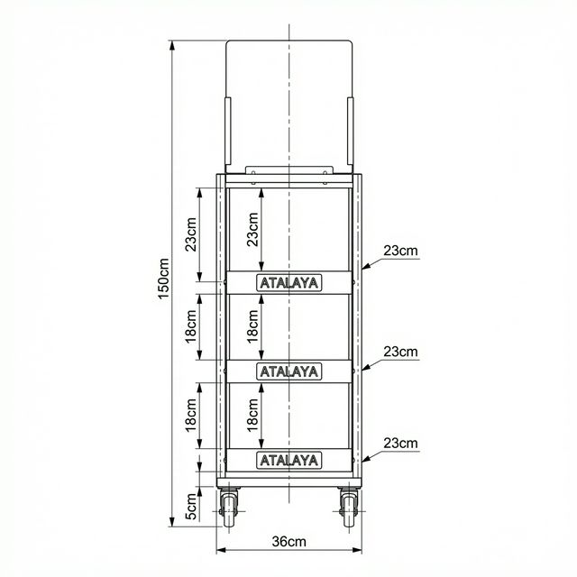

# Materiel & Udstyr — Backlog

> **Status:** Afventer — gemmes til fremtidig udvikling

## Beskrivelse

Ny sektion i Lager-appen til håndtering af materiel og udstyr, f.eks. display-stativer og trolleys.

## Reference: Atalaya Display Trolley

### Mål
| Del | Mål |
|---|---|
| Totalhøjde | 150 cm |
| Bredde | 36 cm |
| Hyldedybde | 23 cm |
| Bund/hjul | 5 cm |
| Øverste hylde | 23 cm |
| Midterhylde | 18 cm |
| Nederste hylde | 18 cm |

## TODO
- [ ] Definér krav til "Materiel & Udstyr"-sektionen
- [ ] Design UI for materiel-oversigt
- [ ] Implementér backend (database, API)
- [ ] Implementér frontend
